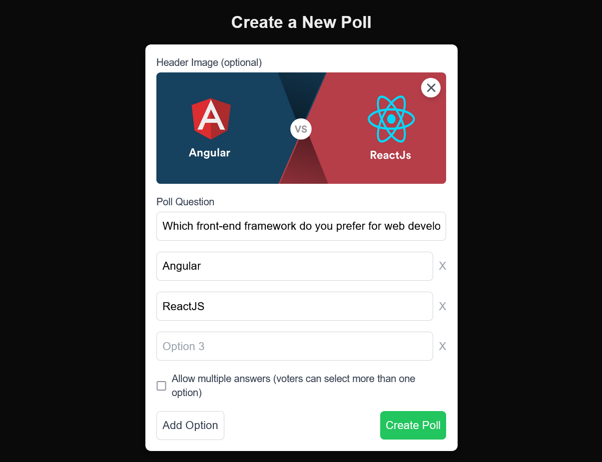

# QuickPoll

QuickPoll is a modern, user-friendly web application that allows users to create, share, and participate in polls with ease. Get instant results and insights from your audience.

## Features

- Create polls with multiple options
- Vote on existing polls
- Support for multiple choice polls (select more than one option)
- Add optional header images to polls
- Responsive design for mobile and desktop

## Screenshots


_Create Poll Form: Users can easily create new polls with multiple options and optional header images._


_User can add more options to the poll or delete them_


_Voting Page: Users can vote on existing polls and see the results in real-time._


_Results Page: Detailed view of poll results with real-time updates and visual representations._

## Technologies Used

- **Next.js**: React framework for server-side rendering and routing
- **TypeScript**: For type-safe code
- **Tailwind CSS**: For responsive and customizable styling
- **Prisma**: ORM for database management
- **SQLite**: Lightweight database for storing polls and votes

## API Routes

The following API routes are available:

- `POST /api/poll`: Create a new poll
- `GET /api/poll`: Fetch all polls
- `GET /api/poll/[id]`: Fetch a specific poll
- `POST /api/poll/[id]`: Submit a vote for a specific poll

## Installation Guide

1. Clone the repository:

   ```
   git clone https://github.com/aleksiliu/QuickPoll-polling-app.git
   cd quickpoll
   ```

2. Install dependencies:

   ```
   npm install
   ```

3. Set up the database:

   - Create a `.env` file in the root directory
   - Add the following line to the `.env` file:
     ```
     DATABASE_URL="file:./dev.db"
     ```
   - Run Prisma migrations:
     ```
     npx prisma migrate dev
     ```

4. Start the development server:

   ```
   npm run dev
   ```

5. Open [http://localhost:3000](http://localhost:3000) in your browser to see the application.
